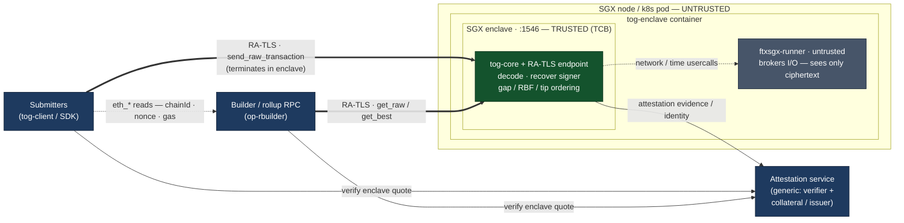

# Transaction Order Guarantor — SGX / Fortanix EDP

Runs the **transaction ordering** (the mempool) inside an Intel SGX enclave as
the smallest trusted unit. Clients send transactions **directly to the enclave**
— there is intentionally **no proxy in the ingestion path** (censorship
resistance) — and query the builder directly for read-only `eth_*`. One input
(`send_raw_transaction`) terminates inside the enclave; two outputs
(`get_raw_transactions`, `get_best_transaction_hashes`) are read from it.

**Attestation is currently a dev stub** and the transport is **plaintext** (even
inside a real enclave). A real attested transport is future work — see
[Attestation](#attestation).

## Showstoppers / things you must provide (read first)

1. **No SGX on an Apple-Silicon Mac.** arm64 has no SGX hardware and there is no
   Fortanix software simulator. You can *edit* and run the plaintext dev path,
   but you **cannot build the enclave for SGX or run it** there. Provision a
   **Linux x86_64 host with SGX2** — easiest is an **Azure confidential VM**
   (DCsv3 / DCdsv3, Ice Lake; large EPC), or bare-metal Ice Lake / Sapphire
   Rapids Xeon. Avoid SGX1 (tiny ~93 MB EPC). Note: **building** the enclave
   image needs only the toolchain (no SGX HW); SGX HW is needed to **run** it.
2. **The reth `OpTransactionPool` cannot go in the enclave.** It transitively
   pulls in Tokio/mio + C dependencies (`c-kzg`, secp256k1-C, mdbx, …). The
   `x86_64-fortanix-unknown-sgx` target cannot compile C via the `cc` crate, so
   that whole stack won't link inside an enclave. The minimal tip ordering is
   therefore **reimplemented in pure Rust** in `crates/tog-core`.
3. **Rust nightly is required** by Fortanix EDP (`rustup target add … --toolchain
   nightly`).
4. **You install the SGX driver + Fortanix tools on the Linux host yourself**
   (see [Build-host setup](#build-host-setup-linux-sgx-box)). PSW/AESM/DCAP are
   only needed once a real attested transport is added.
5. **In-enclave time is untrusted and the pool is volatile.** `SystemTime` is a
   host usercall (host can lie); enclave memory is wiped on restart (no sealing
   yet). Fine for an ephemeral mempool — just know it.

## Architecture

End-state architecture — **real attestation + RA-TLS terminating inside the
enclave**. (Today it's plaintext + a stub attestation; see [Attestation](#attestation).)



Edge legend: **⇒ thick** = RA-TLS secure channel (tx in / ordering out, terminates
in the enclave) · **→ solid** = attestation (generic — managed issuer, or
DCAP + collateral, or any verifier) · **⇢ dotted** = plaintext `eth_*` reads
straight to the builder / rollup RPC, plus the enclave's network/time usercalls.

**Boundaries & limits**

* **TCB = `tog-core` (+ the RA-TLS endpoint) inside the enclave only** (green):
  decode + signer recovery + ordering. Nothing else is trusted.
* **Untrusted** (grey): the node/OS and `ftxsgx-runner`. Because RA-TLS
  *terminates inside the enclave*, the runner brokers the socket but sees **only
  ciphertext** — it can't read, selectively drop, reorder or inject txs. (In
  today's plaintext+stub phase it still sees the bytes; closing that gap is
  exactly what the attested transport does.)
* **Direct to the enclave, no proxy** — the censorship-resistance property: tx
  submission goes straight to the attested enclave, and clients hit the **builder
  / rollup RPC directly** for read-only `eth_*` (chainId, nonce, gas), which never
  touches the ordering.
* **Attestation is generic**: the enclave publishes evidence (a quote bound to its
  TLS key); submitters and the builder verify the enclave's identity via an
  attestation service before trusting the channel. The concrete mechanism
  (managed issuer vs DCAP + collateral) is intentionally left open.
* **Hard limits**: enclave heap is bounded by node **EPC** (`heap-size`, default
  2 GiB → needs SGX2); the pool is **ephemeral** (lost on restart) and in-enclave
  **time is untrusted**.

### Crates

| crate         | target                         | role |
|---------------|--------------------------------|------|
| `tog-proto`   | any (pure)                     | length-prefixed JSON wire protocol (3 ops + stub attestation) |
| `tog-core`    | any (pure)                     | **TCB**: decode + signer recovery + tip ordering, unit-tested |
| `tog-enclave` | `x86_64-fortanix-unknown-sgx`  | client listener (no Tokio), dispatches to `tog-core` |
| `tog-client`  | normal                         | test/reference client (+ dev stub attestation) |

Read-only `eth_*` is **not** proxied — clients call the builder directly, so no
untrusted component sits in the ingestion path.

### No-Tokio model

The enclave uses blocking `std::net` + one OS thread per connection. SGX threads
are preallocated (`threads` in `crates/tog-enclave/Cargo.toml`
`[package.metadata.fortanix-sgx]`), so that number caps concurrent connections.
No async runtime is needed or wanted — it shrinks the TCB and avoids mio (which
doesn't target SGX cleanly).

### Ordering & nonce model (no chain state)

The enclave never sees on-chain account state, and doesn't need it to *order*
transactions. [`tog-core::Mempool`](crates/tog-core/src/mempool.rs):

* **per-sender sequencing** — only the contiguous nonce run from an anchor is
  "ready"; anything past a gap is held until it fills,
* **replace-by-fee** — `(sender, nonce)` collisions collapse to the higher tip,
* **cross-sender priority** — ready heads merged greedily by effective tip.

The anchor is the lowest nonce seen, unless an on-chain nonce is supplied via
`Mempool::set_account_nonce` — an untrusted hint that only refines readiness
(final validity is enforced by the builder when it executes the ordering, so a
wrong hint can at worst make the ordering suboptimal, never unsafe). This
replaces the old "fake the account nonce per tx" trick and needs no
state-provider abstraction.

> Note: `set_account_nonce` is currently an **in-enclave API only** — not yet
> exposed over the wire, so the enclave anchors on the lowest nonce it has seen.
> Wiring a hint channel is deferred: in the direct-to-enclave model the untrusted
> host never sees decrypted txs (hence not the senders), so a future hint would
> come from the builder's get-best request or an enclave-initiated
> `eth_getTransactionCount` call.

## Build & run

### Pure-Rust core + dev dataplane (works anywhere, incl. an arm64 Mac)

```bash
cargo test  -p tog-proto -p tog-core   # the logic that matters, verifiable locally
cargo run   -p tog-enclave             # PLAINTEXT dev server on :1546
```

### Test client (`tog-client`)

```bash
# end-to-end smoke test against the dev enclave (start it first, on :1546):
cargo run -p tog-client -- --addr 127.0.0.1:1546 demo
#   → sends sample txs with tips 5/100/50; get-best returns 100,50,5; get-raw drains.

cargo run -p tog-client -- send 0x02f8...      # submit a real raw tx
cargo run -p tog-client -- get-best            # print the ordering
```

The plaintext `demo` path is verified working end-to-end on an arm64 Mac.

#### Dev stub attestation

The enclave can present a FAKE attestation so the *attested-channel shape* — peer
presents an attestation, the client surfaces/gates on it, then the session
proceeds — can be exercised before a real transport exists. Opt in on **both**
ends (runtime, no rebuild):

```bash
TOG_STUB_ATTEST=1 cargo run -p tog-enclave            # enclave sends a FAKE attestation
cargo run -p tog-client -- --attest-stub demo         # client surfaces it, then runs
#   🔒 attestation: STUB (dev) — mr_enclave=0xdede… mr_signer=0xbebe…  ⚠ proves NOTHING
```

It's deliberately unmistakable: a `stub: true` tripwire + placeholder
measurements + a "NOT A REAL SGX QUOTE" note. Both ends must opt in (the
attestation is an app-level frame, so a one-sided mismatch desyncs the stream).
This works the same on the host dev server and inside a real enclave.

### Enclave (Linux SGX host, nightly)

```bash
rustup target add x86_64-fortanix-unknown-sgx --toolchain nightly
cargo install fortanix-sgx-tools sgxs-tools

cargo +nightly build --release -p tog-enclave --target x86_64-fortanix-unknown-sgx

# with the runner configured (see setup §5), this converts + signs + runs:
TOG_STUB_ATTEST=1 cargo +nightly run -p tog-enclave --target x86_64-fortanix-unknown-sgx
# …or do it by hand:
ftxsgx-elf2sgxs target/x86_64-fortanix-unknown-sgx/release/tog-enclave \
    --heap-size 2147483648 --stack-size 262144 --threads 16 --debug \
    --output tog-enclave.sgxs
sgxs-sign --key signing-key.pem tog-enclave.sgxs tog-enclave.sig
ftxsgx-runner tog-enclave.sgxs
```

The plaintext transport means the SGX build needs no TLS/attestation deps.

### Docker (build with no Rust on the host)

`Dockerfile.enclave` is multi-stage: the nightly toolchain + Fortanix tools live
in the build stage, so the build host needs **only Docker** (build it on any
x86_64 Linux, incl. CI — no SGX hardware needed just to *build*). Running needs
the kernel SGX driver passed in; on FLC hardware (which EDP requires) no AESM is
needed to launch.

```bash
docker build -f Dockerfile.enclave -t tog-enclave .

docker run --rm --device /dev/sgx_enclave \
  -e TOG_ENCLAVE_BIND=0.0.0.0:1546 -e TOG_STUB_ATTEST=1 -p 1546:1546 \
  tog-enclave
```

Docker isolates the binary, not the silicon — SGX is hardware and can't be
virtualized away; the machine that runs the enclave needs the SGX device.
Kubernetes: [`k8s/tog.yaml`](k8s/tog.yaml) deploys the enclave with the SGX
device-plugin EPC request and `TOG_STUB_ATTEST=1`.

## Build-host setup (Linux SGX box)

Ubuntu 22.04/24.04 x86_64. For the current (stub) mode you need steps 0–1 + 3–6;
step 2 (PSW/AESM/DCAP) is only for a real attested transport later. If you only
ever ship via Docker, steps 3–5 live in the image's build stage.

**0. Hardware / VM** — CPU with SGX **+ FLC**; for SGX2 / large EPC use Azure
DCsv3 / DCdsv3 (pre-enabled) or Ice Lake / Sapphire Rapids bare metal (enable SGX
in BIOS, not "software controlled"). Kernel ≥ 5.11.

**1. SGX driver** — kernel ≥ 5.11 is in-tree; verify `ls /dev/sgx_enclave
/dev/sgx_provision` and add yourself to the `sgx` group. Older kernels: install
Intel's out-of-tree DCAP driver (`/dev/isgx`).

**2. PSW + AESM** — *only needed for a real attested transport (future).* Use the
keyring method (`apt-key` is deprecated/removed on recent Ubuntu):
```bash
curl -fsSL https://download.01.org/intel-sgx/sgx_repo/ubuntu/intel-sgx-deb.key \
  | sudo gpg --dearmor -o /usr/share/keyrings/intel-sgx.gpg
echo "deb [signed-by=/usr/share/keyrings/intel-sgx.gpg] https://download.01.org/intel-sgx/sgx_repo/ubuntu $(lsb_release -cs) main" \
  | sudo tee /etc/apt/sources.list.d/intel-sgx.list
sudo apt-get update
# EDP requires FLC hardware, which does NOT need the legacy launch plugin
# (libsgx-aesm-launch-plugin) — installing it pins libsgx-urts to an older
# version and breaks the DCAP deps. Install the consistent runtime + DCAP set:
sudo apt-get install -y \
    libsgx-enclave-common libsgx-urts libsgx-pce-logic libsgx-qe3-logic \
    sgx-aesm-service libsgx-aesm-pce-plugin libsgx-aesm-ecdsa-plugin \
    libsgx-aesm-quote-ex-plugin libsgx-dcap-ql libsgx-dcap-default-qpl
```
Check `systemctl status aesmd` and `/var/run/aesmd/aesm.socket`. (Unrelated
`NO_PUBKEY` errors from other repos — e.g. a stale Yarn source — will fail
`apt-get update`; remove or re-key those sources first. If you still hit unmet
deps on `libsgx-pce-logic`/`libsgx-urts`, a stray `libsgx-aesm-launch-plugin` is
pinning an old `libsgx-urts` — `sudo apt-get remove -y libsgx-aesm-launch-plugin`,
re-run `apt-get update`, and reinstall the set above.)

**3. Build deps** (the C deps the Fortanix tools need + openssl for signing):
```bash
sudo apt-get install -y build-essential pkg-config libssl-dev protobuf-compiler
```

**4. Rust nightly + the EDP target:**
```bash
curl --proto '=https' --tlsv1.2 -sSf https://sh.rustup.rs | sh
rustup toolchain install nightly
rustup target add x86_64-fortanix-unknown-sgx --toolchain nightly
```

**5. Fortanix tools + cargo runner** — `cargo install fortanix-sgx-tools
sgxs-tools`, then add to `~/.cargo/config.toml`:
```toml
[target.x86_64-fortanix-unknown-sgx]
runner = "ftxsgx-runner-cargo"
```

**6. Verify the box:** `sgx-detect` (reports SGX enabled, driver, and whether it
can actually run an enclave).

## Attestation

The enclave currently has **no real attestation**: the transport is plaintext,
and `TOG_STUB_ATTEST=1` makes it present a fake attestation document that
`tog-client --attest-stub` reads (see [Dev stub attestation](#dev-stub-attestation)).
This is enough to develop and integrate the end-to-end flow on real SGX.

A real attested transport (terminating TLS inside the enclave, with the SGX quote
bound to the TLS key and verified by clients) is **future work**. The transport
seam is [`crates/tog-enclave/src/transport.rs`](crates/tog-enclave/src/transport.rs)
(`Transport::init` / `Transport::accept` → a `Read + Write` `Session`), so it can
be added without touching `main.rs` or the protocol.

## Validate against your builder

`tog-core`'s ordering implements gap-aware per-sender sequencing, replace-by-fee
and greedy tip priority. Still **validate it against your builder's actual
selection** (base-fee handling, tie-breaks) before treating the output as a
guarantee. OP deposit txs (type `0x7E`) are not expected via
`send_raw_transaction` and are not handled.
